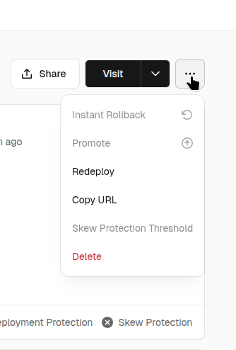
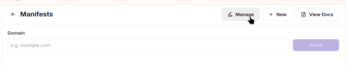
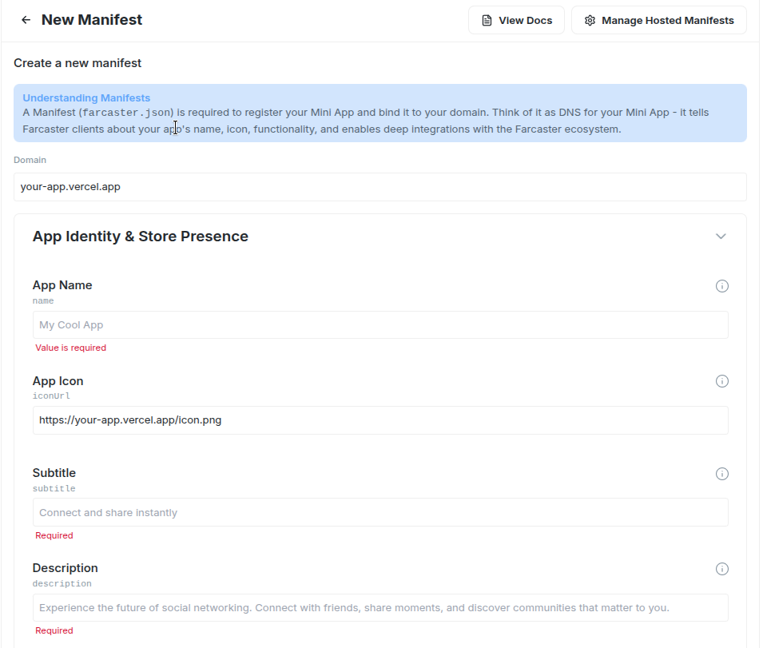

# Farcaster MiniKit Integration Guide

## Create MiniKit Project with BetSwirl

### Using Existing Template

```shell
# Clone the SDK repository
git clone https://github.com/betswirl/sdk.git
cd sdk/examples/farcaster-frame

# Install dependencies
pnpm install --ignore-workspace
```

### Create from Scratch

```shell
# Create new MiniKit project
npx create-onchain --mini
cd your-mini-project

# Install BetSwirl UI
npm install @betswirl/ui-react
```

**During installation:**
`Coinbase Developer Platform Client API Key` - skip this (optional for mini-app)
If needed later, add to .env: `NEXT_PUBLIC_ONCHAINKIT_API_KEY=your_api_key`

### Set up Providers

Replace the code in `app/providers.tsx` with:

```tsx
"use client";

import { MiniKitProvider } from "@coinbase/onchainkit/minikit";
import { type AppConfig } from '@coinbase/onchainkit'
import { QueryClient, QueryClientProvider } from "@tanstack/react-query";
import { type ReactNode, useState } from "react";
import { http, type Hex } from "viem";
import { WagmiProvider, createConfig } from "wagmi";
import { base } from "wagmi/chains";
import { BetSwirlSDKProvider, type TokenWithImage } from "@betswirl/ui-react";

const DEGEN_TOKEN: TokenWithImage = {
  address: "0x4ed4E862860beD51a9570b96d89aF5E1B0Efefed" as Hex,
  symbol: "DEGEN",
  decimals: 18,
  image: "https://www.betswirl.com/img/tokens/DEGEN.svg",
};

const config = createConfig({
  chains: [base],
  transports: {
    [base.id]: http(),
  },
  ssr: true,
});

const onChainKitConfig: AppConfig = {
  wallet: {
    display: "modal",
  }
}

export function Providers(props: { children: ReactNode }) {
  const [queryClient] = useState(() => new QueryClient());

  return (
    <WagmiProvider config={config}>
      <QueryClientProvider client={queryClient}>
        <MiniKitProvider
          apiKey={process.env.NEXT_PUBLIC_ONCHAINKIT_API_KEY}
          chain={base}
          config={onChainKitConfig}
        >
          <BetSwirlSDKProvider initialChainId={base.id} bankrollToken={DEGEN_TOKEN}>
            {props.children}
          </BetSwirlSDKProvider>
        </MiniKitProvider>
      </QueryClientProvider>
    </WagmiProvider>
  );
}
```

### Add Game Component

Add the game component in `app/page.tsx`:

```tsx
import { DiceGame } from "@betswirl/ui-react";
import "@betswirl/ui-react/styles.css";

// ... existing code ...

<main className="flex-1">
  <DiceGame />
</main>
```

### Start dev server

```shell
npm run dev
```

Open in browser http://localhost:3000/

## Environment Variables

`.env.example` 

Configure the `.env` file in the root directory (included with the template), or you can set environment variables in your Vercel project settings.

**Security note**: The manifest file is publicly accessible at `/.well-known/farcaster.json`. Never store sensitive data in manifest environment variables. If you don't need certain environment variables, you can leave them empty.

**How manifest generation works:**
The manifest file is automatically generated during build through api route `app/.well-known/farcaster.json/route.ts`. This endpoint reads environment variables and returns JSON with your mini-app configuration that Farcaster uses.

**Required variables for manifest:**
```bash
NEXT_PUBLIC_ONCHAINKIT_PROJECT_NAME="YOUR_PROJECT_NAME"
NEXT_PUBLIC_URL="https://[your-app].vercel.app"
NEXT_PUBLIC_APP_ICON=$NEXT_PUBLIC_URL/icon.png
NEXT_PUBLIC_APP_SUBTITLE="Your App Subtitle"
NEXT_PUBLIC_APP_DESCRIPTION="Your app description"
NEXT_PUBLIC_APP_SPLASH_IMAGE=$NEXT_PUBLIC_URL/splash.png
NEXT_PUBLIC_SPLASH_BACKGROUND_COLOR="#your-color-in-hex"
NEXT_PUBLIC_APP_PRIMARY_CATEGORY=games
```

```bash
# For app preview
NEXT_PUBLIC_APP_HERO_IMAGE=$NEXT_PUBLIC_URL/hero.png
```

These variables may not be filled in, but they must at least be present in the .env file with empty values, otherwise the manifest will be displayed as invalid.
```bash
FARCASTER_HEADER=
FARCASTER_PAYLOAD=
FARCASTER_SIGNATURE=
```

**Manifest properties:**
Complete list of all available manifest properties with descriptions - [Define your application configuration](https://miniapps.farcaster.xyz/docs/guides/publishing#define-your-application-configuration). 

All properties are configured through environment variables in the `app/.well-known/farcaster.json/route.ts` file.

## Deploy to Vercel

Choose one of the following deployment methods:

**Vercel CLI**
```shell
# Install Vercel CLI
npm i -g vercel

# Run deployment from root project
vercel
```
If you deploy to a new project, the domain will be created from the project's name. If such a domain already exists, Vercel will generate a new one based on the project's name. You can find your public domain in the project settings on Vercel.

**Git Integration**
* Sign in to [vercel.com](https://vercel.com) with GitHub
* Click "Add New..." → "Project"
* Select your repository
* Click "Import" → "Deploy"
* Get public URL after ~2 minutes

If you added environment variables for the manifest (e.g., NEXT_PUBLIC_URL) in Vercel project settings after deployment, you need to redeploy. Go to deployments, navigate to your project and click redeploy.   


To update your production deployment from the command line, use `vercel --prod`. This will update your production domain. Without the `--prod` flag, Vercel creates a new preview deployment with an automatically generated URL intended for testing and not publicly accessible by default.

[CLI Vercel Deploy](https://vercel.com/docs/cli/deploy)   
[Managing Deployments](https://vercel.com/docs/projects/project-dashboard#deployments)

## Publish and Test mini-app in Farcaster
Detailed instructions can be found here - https://miniapps.farcaster.xyz/docs/guides/publishing#steps

After deployment, the manifest can be viewed at this URL - https://[your-app].vercel.app/.well-known/farcaster.json

To test and configure your manifest:
1. Go to https://farcaster.xyz/~/developers/mini-apps/manifest
2. Paste your domain in the field without https and trailing slash (`[your-app].vercel.app`)

### Test mini-app:
To test your mini-app in Farcaster, publishing the manifest is not required. Once you enter your domain, you'll be able to see your manifest and launch the mini-app in the Farcaster frame. 

If the manifest is valid, you'll see - "Mini App configuration is valid."

You can launch the application by clicking the Launch button.


If the manifest is not valid, you'll see - "[your-app].vercel.app does not have a valid manifest setup."


### Publish Manifest:
Farcaster hosted manifests simplify managing and updating your mini app manifest without redeploying your code.

1. Click the "Manage" button

2. Enter the domain address and fill in all necessary fields and click "Submit"


After that, you'll get a URL like - https://api.farcaster.xyz/miniapps/hosted-manifest/YOUR_MANIFEST_ID

**If you're using our "farcaster-frame" template, you need to:**
* Add the FARCASTER_MANIFEST_URL environment variable with this url to your .env file
* Update deployment

If you created the application from scratch, then you need to set up a redirect to your manifest in the next.config file.   
[Next js redirects documentation](https://nextjs.org/docs/app/api-reference/config/next-config-js/redirects)   
You can find an example at `sdk/examples/farcaster-frame/next.config.mjs`. 

### Post your mini-app

Once you have a valid manifest, you can share your mini-app by posting its URL (https://[your-app].vercel.app) in a Farcaster cast. Users will be able to launch it directly from the cast. This will work even without publishing the manifest and generating Account association.

### Account Association
Account association links the domain to your account. After this, users will be able to add your application to their mini-app list. You can generate a signed account association object using the [Mini App Manifest Tool](https://farcaster.xyz/~/developers/mini-apps/manifest) in Warpcast. You need to have the Warpcast app installed on your phone.

On the manifest page:
1. Click the "Generate account association" button   

2. On your phone, scan the provided QR code or go to the link - https://farcaster.xyz/~/developers/register?domain=[your-app].vercel.app.
You should be redirected to the "Account Association" page in the Warpcast app for message signing.
3. In the app, click the "Sign as [your username]" button.   
If everything went well, you'll see the message - "Signature sent, continue on desktop."
4. Return to the manifest page on your desktop. A modal window should open with the accountAssociation object containing your signed message. If it doesn't open, try refreshing the page and clicking "Generate account association" again.
5. Copy your accountAssociation message, go to your project and fill in the environment variables:
```bash
FARCASTER_HEADER=
FARCASTER_PAYLOAD=
FARCASTER_SIGNATURE=
```
6. Update your deployment
7. Return to the manifest page [Mini App Manifest Tool](https://farcaster.xyz/~/developers/mini-apps/manifest) and refresh it, or click the "Refresh" button.   
In the Account Association section, you should see "✓ Associated with your account" next to your domain. In the domain verification details 
table, the Signature field should show "✓ Verified". This means the domain has been successfully associated with your account.

[Verifying ownership](https://miniapps.farcaster.xyz/docs/guides/publishing#verifying-ownership)

## Mini App search visibility

For your app to appear in Farcaster’s mini-app search, Account Association must be configured. Without it, your app will not be included in search results.

For more information, see: [App Discovery & Search](https://miniapps.farcaster.xyz/docs/guides/discovery) 

## Documentation

- [MiniKit Documentation](https://docs.base.org/wallet-app/build-with-minikit/quickstart)
- [Farcaster Frame Publishing](https://miniapps.farcaster.xyz/docs/guides/publishing)
- [Deploying to Vercel](https://vercel.com/docs/deployments)
