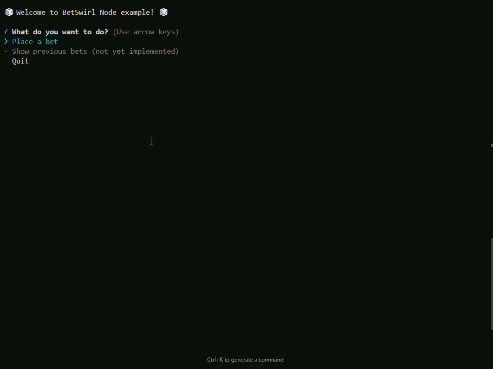

# Node CLI example

This example shows how to use most of the features of the **betswirl/sdk-core** package. This is a good example to check if you want to use the sdk in a server application.

## Installation

```bash
pnpm install
```

## Run the app

### Environment variables

Create a `.env` file in the root of the project and add the following variables:

```bash
PRIVATE_KEY="0x..."
PUBLIC_ADDRESS="0x..."
RPC_URL="https|wss://..."
```

### Commands

```bash
npm run start
```

## Preview


