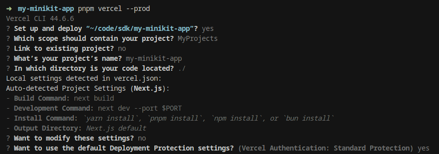
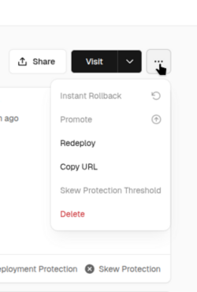
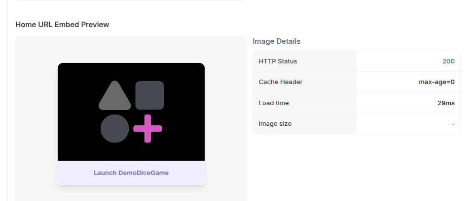
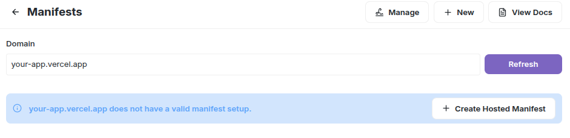
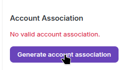

# Farcaster MiniKit Integration Guide

## Create MiniKit Project with BetSwirl

### Using Existing Template

```shell
# Clone the SDK repository
git clone https://github.com/betswirl/sdk.git
cd sdk/examples/farcaster-frame

# Install dependencies
pnpm install --ignore-workspace
```

### Create from Scratch

```shell
# Create new MiniKit project
npx create-onchain --mini

# ═════════════════════════════════════════════════════════════════════
# ? Enter your Coinbase Developer Platform Client API Key: (optional) ›
# ═════════════════════════════════════════════════════════════════════
# > Skip this (press Enter) - optional for mini-app
# If needed later, add to .env: `NEXT_PUBLIC_ONCHAINKIT_API_KEY=your_api_key`

cd your-mini-project

# Install BetSwirl UI
npm install @betswirl/ui-react
```

### Set up Providers

Replace the code in `app/providers.tsx` with:

```tsx
"use client";

import { MiniKitProvider } from "@coinbase/onchainkit/minikit";
import { type AppConfig } from '@coinbase/onchainkit'
import { QueryClient, QueryClientProvider } from "@tanstack/react-query";
import { type ReactNode, useState } from "react";
import { http, type Hex } from "viem";
import { WagmiProvider, createConfig } from "wagmi";
import { base } from "wagmi/chains";
import { BetSwirlSDKProvider, type TokenWithImage } from "@betswirl/ui-react";

const DEGEN_TOKEN: TokenWithImage = {
  address: "0x4ed4E862860beD51a9570b96d89aF5E1B0Efefed" as Hex,
  symbol: "DEGEN",
  decimals: 18,
  image: "https://www.betswirl.com/img/tokens/DEGEN.svg",
};

const config = createConfig({
  chains: [base],
  transports: {
    [base.id]: http(),
  },
  ssr: true,
});

const onChainKitConfig: AppConfig = {
  wallet: {
    display: "modal",
  }
}

export function Providers(props: { children: ReactNode }) {
  const [queryClient] = useState(() => new QueryClient());

  return (
    <WagmiProvider config={config}>
      <QueryClientProvider client={queryClient}>
        <MiniKitProvider
          apiKey={process.env.NEXT_PUBLIC_ONCHAINKIT_API_KEY}
          chain={base}
          config={onChainKitConfig}
        >
          <BetSwirlSDKProvider initialChainId={base.id} bankrollToken={DEGEN_TOKEN}>
            {props.children}
          </BetSwirlSDKProvider>
        </MiniKitProvider>
      </QueryClientProvider>
    </WagmiProvider>
  );
}
```

### Add Game Component

Add the game component in `app/page.tsx`.
This code is enough:

```tsx
"use client";

import { useAddFrame, useMiniKit } from "@coinbase/onchainkit/minikit";
import { useCallback, useEffect, useMemo, useState } from "react";
import { Button, Icon } from "./components/DemoComponents";
import { DiceGame } from "@betswirl/ui-react";
import "@betswirl/ui-react/styles.css";

export default function App() {
  const { setFrameReady, isFrameReady, context } = useMiniKit();
  const [frameAdded, setFrameAdded] = useState(false);

  const addFrame = useAddFrame();

  useEffect(() => {
    if (!isFrameReady) {
      setFrameReady();
    }
  }, [setFrameReady, isFrameReady]);

  const handleAddFrame = useCallback(async () => {
    const frameAdded = await addFrame();
    setFrameAdded(Boolean(frameAdded));
  }, [addFrame]);

  const saveFrameButton = useMemo(() => {
    if (context && !context.client.added) {
      return (
        <Button
          variant="ghost"
          size="sm"
          onClick={handleAddFrame}
          className="text-[var(--app-accent)] p-4"
          icon={<Icon name="plus" size="sm" />}
        >
          Save Frame
        </Button>
      );
    }

    if (frameAdded) {
      return (
        <div className="flex items-center space-x-1 text-sm font-medium text-[#0052FF] animate-fade-out">
          <Icon name="check" size="sm" className="text-[#0052FF]" />
          <span>Saved</span>
        </div>
      );
    }

    return null;
  }, [context, frameAdded, handleAddFrame]);

  return (
    <div className="flex flex-col min-h-screen font-sans text-[var(--app-foreground)] mini-app-theme">
      <div className="w-full max-w-md mx-auto px-4 py-3">
        <header className="flex justify-between items-center mb-3 h-11">
          <div>{saveFrameButton}</div>
        </header>

        <main className="flex justify-center">
          <DiceGame />
        </main>
      </div>
    </div>
  );
}
```

### Start dev server

```shell
npm run dev
```

Open in browser `http://localhost:3000/`

## Environment Variables

- **If you already have a project on Vercel**, you can add the environment variables in the project settings before deploying - see [Add environment variables on Vercel](#add-environment-variables-on-vercel).

- **If you are creating a new project**, you can add the environment variables after the initial deployment. Go to the deployment step - [Deploy to Vercel](#deploy-to-vercel).

>⚠️ **Security note**: The manifest file is publicly accessible at `/.well-known/farcaster.json`. Never store sensitive data in manifest environment variables.

>**How manifest generation works:**
>The manifest is generated during build through api route `app/.well-known/farcaster.json/route.ts`. This endpoint reads environment variables and returns JSON with your mini-app configuration for Farcaster.

You can find a template with the environment variables in `.env.example`, or in `.env` if you set up the project from scratch.

**Required variables for manifest:**
```bash
# Full public URL with your domain.   
NEXT_PUBLIC_URL="https://[your-app].vercel.app"
NEXT_PUBLIC_ONCHAINKIT_PROJECT_NAME="YOUR_PROJECT_NAME"
NEXT_PUBLIC_APP_ICON=$NEXT_PUBLIC_URL/icon.png
NEXT_PUBLIC_APP_HERO_IMAGE=$NEXT_PUBLIC_URL/hero.png # For app preview

# ════════════════════════════════════════════════════════════════════
# > Can be set after app registration (see "Account Association"):
# ════════════════════════════════════════════════════════════════════
# Required for search indexing
NEXT_PUBLIC_APP_DESCRIPTION="Your app description"

# Recommended to set. May be required for search indexing in Warpcast
NEXT_PUBLIC_APP_SUBTITLE="Your App Subtitle"
NEXT_PUBLIC_APP_SPLASH_IMAGE=$NEXT_PUBLIC_URL/splash.png
NEXT_PUBLIC_SPLASH_BACKGROUND_COLOR="#your-color-in-hex"
NEXT_PUBLIC_APP_PRIMARY_CATEGORY=games
```

**Optional variables:**
```bash
# Shared/OnchainKit variables
NEXT_PUBLIC_ICON_URL=$NEXT_PUBLIC_URL/logo.png
NEXT_PUBLIC_ONCHAINKIT_API_KEY=

# Optional Frame metadata items below
NEXT_PUBLIC_APP_TAGLINE=
NEXT_PUBLIC_APP_OG_TITLE=farcaster-frame
NEXT_PUBLIC_APP_OG_DESCRIPTION=
NEXT_PUBLIC_APP_OG_IMAGE=$NEXT_PUBLIC_URL/hero.png
```

Some variables use template images. Feel free to replace them, but keep the same format and dimensions.   

**Additional Information:**    
- All properties are configured through environment variables in the `app/.well-known/farcaster.json/route.ts` file.
- [Complete list Manifest properties](https://miniapps.farcaster.xyz/docs/guides/publishing#define-your-application-configuration).   


## Deploy to Vercel

Choose one of the following deployment methods: **Vercel CLI** or **Git Integration**.

### Vercel CLI
>⚠️ **Important:** If you set up the project from scratch, create a `.vercelignore` file in the root directory and add `.env` and any other files or folders you want to exclude from deployment.

`.vercelignore`
```bash
.env
# Exclude others
...
```

```shell
# Install Vercel CLI
npm i -g vercel

# Check for linting errors and fix if any
npm run lint

# Log in to Vercel
vercel login

# Run deployment from root project
vercel --prod
```



### Git Integration
* Sign in to [vercel.com](https://vercel.com) with GitHub
* Click "Add New..." → "Project"
* Select your repository
* Click "Import" → "Deploy"
* Get public URL after ~2 minutes

**Additional Information:**  
- [CLI Vercel Deploy](https://vercel.com/docs/cli/deploy)   

## Check Domain Settings
If you deploy to a new project, the domain will be created from the project's name. If such a domain already exists, Vercel will generate a new one based on the project's name. You can find and change your public domain in the project settings on Vercel. 

**Add a new domain:**
[Add and configure domain](https://vercel.com/docs/domains/working-with-domains/add-a-domain)

**Find or edit an existing domain:**   

1. Go to your project on Vercel   
2. Open the **"Settings"** tab   


3. Go to the **"Domains"** section      


4. Click **"Edit"** next to your domain     


5. Update your domain and click **"Save"**   

## Add Environment Variables on Vercel

Follow these steps to add [Environment Variables](#environment-variables) on Vercel:
1. Go to your project on Vercel
2. Open the **"Settings"** tab   


3. Go to the **"Environments"** section      


4. Select the **"Production"** domain   


5. Click **"Add Environment Variables"**   


6. Add all [Environment variables](#environment-variables) at once by pasting them into the input field or importing your `.env` file to avoid adding them one by one. 
Replace `$NEXT_PUBLIC_URL` with your public URL in all variables where it is used.   


7. Click **"Save"**

## Redeploy  
If you added environment variables for the manifest in Vercel project settings after deployment, you need to redeploy. 
 
1. Go to your project dashboard in Vercel
2. Click on the **"Deployments"** tab
3. Select the latest deployment
4. Click the **"Redeploy"**       


## Test mini-app in Farcaster

After deployment, the manifest can be viewed at this URL - `https://[your-app].vercel.app/.well-known/farcaster.json`

To test your manifest:
1. Go to `https://farcaster.xyz/~/developers/mini-apps/manifest`
2. Paste your domain in the field without https and trailing slash (`[your-app].vercel.app`)

After that, you'll be able to see your manifest and launch the mini-app in the Farcaster frame. 

If the manifest is valid, you'll see - `"Mini App configuration is valid."` in the **"Mini App Configuration"** section.

You can launch the application by clicking the **Launch** button.



If the manifest is not valid, check if you have correctly filled all required environment variables and redeployed after making changes.

This message  - `"[your-app].vercel.app does not have a valid manifest setup."` appears if the domain is not associated with your account. It's not required for mini app rendering or testing.   
   

**Additional Information:**
- [Hosted Manifest Guide](hosted-manifest-guide.md)

## Post your mini-app

Once you have a valid manifest, you can share your mini-app by posting its URL (`https://[your-app].vercel.app`) in a Farcaster cast. Users will be able to launch it directly from the cast. This will work even without generating Account association.

## Account Association
Account association links the domain to your account. After this, users will be able to add your application to their mini-app list. You can generate a signed account association object using the [Mini App Manifest Tool](https://farcaster.xyz/~/developers/mini-apps/manifest) in Warpcast. You need to have the Warpcast app installed on your phone.

On the manifest page:
1. Click the **"Generate account association"** button   

   

2. On your phone, scan the provided QR code or go to the link - `https://farcaster.xyz/~/developers/register?domain=[your-app].vercel.app`.
You should be redirected to the **"Account Association"** page in the Warpcast app for message signing.
3. In the app, click the **"Sign as [your username]"** button.   
If everything went well, you'll see the message - `"Signature sent, continue on desktop."`
4. Return to the manifest page on your desktop. A modal window should open with the `accountAssociation` object containing your signed message. If it doesn't open, try refreshing the page and clicking **"Generate account association"** again.
5. Copy your `accountAssociation` message and add these variables to your Vercel project:   
[How add environment variables on Vercel](#add-environment-variables-on-vercel)    
```bash
FARCASTER_HEADER=
FARCASTER_PAYLOAD=
FARCASTER_SIGNATURE=
```

6. [Update your deployment](#redeploy)
7. Return to the manifest page [Mini App Manifest Tool](https://farcaster.xyz/~/developers/mini-apps/manifest) and refresh it, or click the **"Refresh"** button.      
In the **Account Association** section, you should see `"✓ Associated with your account"` next to your domain.   
In the domain verification details table, the **Signature** field should show `"✓ Verified"`. This means the domain has been successfully associated with your account.

**Additional Information:**
- [Verifying ownership](https://miniapps.farcaster.xyz/docs/guides/publishing#verifying-ownership)

## Mini App search visibility

For your app to appear in Farcaster's mini-app search, **Account Association** must be configured. Without it, your app will not be included in search results.

Set these variables if they are not already set:   

1. [Add environment variables on Vercel](#add-environment-variables-on-vercel)
```bash
# Required for search indexing
NEXT_PUBLIC_APP_DESCRIPTION="Your app description"

# Recommended to set. May be required for search indexing in Warpcast
NEXT_PUBLIC_APP_SUBTITLE="Your App Subtitle"
NEXT_PUBLIC_APP_SPLASH_IMAGE=$NEXT_PUBLIC_URL/splash.png
NEXT_PUBLIC_SPLASH_BACKGROUND_COLOR="#your-color-in-hex"
NEXT_PUBLIC_APP_PRIMARY_CATEGORY=games
```
2. [Update your deployment](#redeploy)

For more information, see: [App Discovery & Search](https://miniapps.farcaster.xyz/docs/guides/discovery) 

## Documentation

- [MiniKit Documentation](https://docs.base.org/wallet-app/build-with-minikit/quickstart)
- [Farcaster Mini Apps Publishing](https://miniapps.farcaster.xyz/docs/guides/publishing)
- [Deploying to Vercel](https://vercel.com/docs/deployments)
