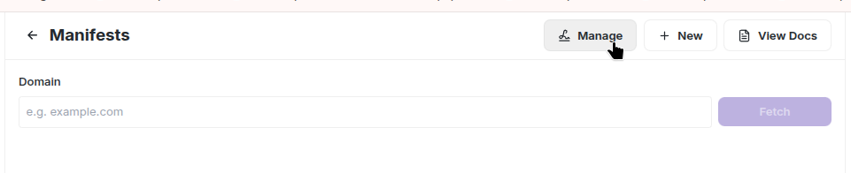

### Hosted Manifest:
Farcaster hosted manifests simplify updating your mini app manifest without redeploying your code.

1. Go to `https://farcaster.xyz/~/developers/mini-apps/manifest`
2. Click the **"Manage"** button   

3. Enter the domain address and fill in all necessary fields and click **"Submit"**

    After that, you'll get a URL like - `https://api.farcaster.xyz/miniapps/hosted-manifest/YOUR_MANIFEST_ID`

4. Add Manifest URL to your app  
    **If you're using our "farcaster-frame" template**, add the `FARCASTER_MANIFEST_URL` environment variable with this URL to your Vercel project - see [Add environment variables on Vercel](betswirl-farcaster-guide.md#add-environment-variables-on-vercel)   

    **If you created the application from scratch**, you need to set up a redirect to your manifest in the `next.config` file.      
    You can find an example at `sdk/examples/farcaster-frame/next.config.mjs`.   

5. [Update your deployment](betswirl-farcaster-guide.md#redeploy)

**Additional Information:**
- [Next js redirects documentation](https://nextjs.org/docs/app/api-reference/config/next-config-js/redirects) 
